<div align="center">
  
</div>

<div align="center">
  
  [](https://git.io/typing-svg)
  
  
  
</div>

---

## 🎯 Who Am I?

```python
class Bhavesh:
    def __init__(self):
        self.name = "Bhavesh Mali"
        self.role = "BSc Computer Science Student (2nd Year)"
        self.location = "India 🇮🇳"
        
    def my_strengths(self):
        return {
            "core_skill": "Designing solutions for real-world problems",
            "leadership": "Leading teams and driving projects to completion",
            "presentation": "Communicating ideas clearly and effectively",
            "problem_solving": "Breaking down complex challenges into actionable steps",
            "learning_style": "Learn what's needed, apply it practically",
            "approach": "Quality over quantity, impact over perfection"
        }
    
    def what_i_bring(self):
        return [
            "🎯 Clear vision and execution strategy",
            "🤝 Strong team collaboration and leadership",
            "🎤 Excellent presentation and communication skills",
            "💡 Creative problem-solving mindset",
            "🔧 Practical implementation abilities",
            "📊 Project planning and management"
        ]

me = Bhavesh()
print("I don't just code - I lead, design, and deliver solutions! 🚀")
```

---

## 💪 My Core Strengths

<table>
<tr>
<td width="33%" align="center">

### 🎯 Problem Solving
**Identifying & Solving Real Issues**

- Deep understanding of problems
- Creative solution design
- Practical implementation
- End-to-end thinking

</td>
<td width="33%" align="center">

### 👥 Leadership
**Leading Teams to Success**

- Team coordination
- Project management
- Motivating members
- Driving results

</td>
<td width="33%" align="center">

### 🎤 Presentation
**Communicating with Impact**

- Clear articulation
- Engaging delivery
- Visual storytelling
- Audience connection

</td>
</tr>
</table>

---

## 🏆 Projects That Made an Impact

<table>
<tr>
<td width="50%">

### 🔬 Skin Cancer Classification System
**Deep Learning Pipeline**

**The Problem:** Multi-class skin cancer classification with severe class imbalance

**My Role:**
- 🏗️ Built complete end-to-end data pipeline
- ⚖️ Tackled class imbalance with weighted sampling
- 🧠 Trained dual-architecture models (ResNet/EfficientNet)
- ⚙️ Implemented custom LR schedulers

**Impact:** Highly accurate bulk inference pipeline for minority classes

**Tech:** PyTorch, EfficientNet-B4, ResNet18, Pandas, Scikit-Learn

</td>
<td width="50%">

### 🔄 SecureFlow ETL Pipeline
**Distributed Data Processing System**

**The Problem:** Processing multi-format data with PII and anomalies

**My Role:**
- 🏗️ Architected 1 Producer → 5 Parallel Transformers pipeline
- 🛡️ Implemented dynamic PII masking & validation
- ⚡ Configured rate limiting (5000 msg/sec)
- 📊 Built real-time system monitoring dashboard

**Impact:** Robust fault-tolerant pipeline with Dead Letter Queue

**Tech:** Python, Apache Kafka, Docker, Pandas

</td>
</tr>

<tr>
<td width="50%">

### 🤖 DataSense AI
**Automated EDA & Preprocessing Platform**

**The Problem:** Manual, time-consuming data cleaning and EDA

**My Role:**
- 💻 Built end-to-end full-stack architecture independently
- 🧹 Automated complex data cleaning pipelines
- 📊 Implemented interactive EDA visualizations
- ⚡ Developed auto Python code generation feature

**Impact:** Accelerated data preprocessing with interactive dashboards

**Tech:** Flask, Pandas, Scikit-Learn, Chart.js

</td>
<td width="50%">

### 🚀 Explore More Projects
**Check out my GitHub!**

I am constantly building new things and exploring various technologies, from AI/ML models to full-stack applications.

- 🌟 Star my repositories
- 💡 Explore my code
- 🤝 Let's collaborate on real-world problems

**[View All Projects →](https://github.com/Bhavesh1116)**

</td>
</tr>
</table>

---

## 🛠️ Technical Toolkit

<div align="center">

### Languages & Frameworks


### AI/ML & Data


### Databases & Tools


</div>

---

## 🏆 GitHub Profile Trophies

<div align="center">
  <a href="https://github.com/ryo-ma/github-profile-trophy">
      
  </a>
</div>

---
## 📊 GitHub Analytics

<div align="center">
  
  
</div>

<div align="center">
  
</div>

---

## 🌟 What Sets Me Apart

<div align="center">

<table>
<tr>
<td width="50%">

### 🌟 Leadership Qualities
```
✓ Team coordination & motivation
✓ Project planning & execution
✓ Conflict resolution
✓ Deadline management
✓ Mentoring team members
✓ Decision making under pressure
```

</td>
<td width="50%">

### 🎤 Presentation Skills
```
✓ Clear & engaging communication
✓ Visual storytelling
✓ Audience engagement
✓ Technical concept simplification
✓ Confident public speaking
✓ Effective demonstrations
```

</td>
</tr>
</table>

</div>

---

## 🛠️ My Approach to Projects

```mermaid
graph LR
    A[Identify Problem] --> B[Design Solution]
    B --> C[Plan Execution]
    C --> D[Lead Team]
    D --> E[Build & Test]
    E --> F[Present Results]
    F --> G[Iterate & Improve]
    
    style A fill:#FF6B6B,stroke:#333,stroke-width:2px,color:#000
    style B fill:#4ECDC4,stroke:#333,stroke-width:2px,color:#000
    style C fill:#45B7D1,stroke:#333,stroke-width:2px,color:#000
    style D fill:#FFA07A,stroke:#333,stroke-width:2px,color:#000
    style E fill:#98D8C8,stroke:#333,stroke-width:2px,color:#000
    style F fill:#F7DC6F,stroke:#333,stroke-width:2px,color:#000
    style G fill:#BB8FCE,stroke:#333,stroke-width:2px,color:#000
```

<div align="center">



</div>

---

## 🌟 Current Focus & Goals

<table>
<tr>
<td width="50%">

### 🔭 Working On
- 🎙️ Scaling SwarSuraksha to more languages
- 🤖 Exploring AI applications in real problems
- 🔐 Learning cybersecurity fundamentals
- 📊 Participating in hackathons
- 👥 Leading collaborative projects

</td>
<td width="50%">

### 🎓 Learning & Growing
- Advanced problem-solving techniques
- AI/ML practical applications
- Backend architecture & security
- Team management skills
- Effective presentation strategies

</td>
</tr>
<tr>
<td width="50%">

### 👯 Open to Collaborate On
- Real-world problem-solving projects
- Hackathons & competitions
- Open-source initiatives
- Social impact tech solutions
- Team-based challenges

</td>
<td width="50%">

### 💬 Let's Talk About
- Project ideas & solutions
- Leadership experiences
- Presentation techniques
- Problem-solving approaches
- Team collaboration

</td>
</tr>
</table>

---

## 🏅 Skills & Qualities

<div align="center">

### Technical Skills
```
████████████████░░░░  75%  Python & Backend Development
███████████████░░░░░  70%  AI/ML Implementation
██████████████░░░░░░  65%  Database Management
███████████████░░░░░  70%  Problem Analysis & Design
```

### Soft Skills
```
███████████████████░  90%  Leadership & Team Management
████████████████████  95%  Presentation & Communication
██████████████████░░  85%  Project Planning & Execution
███████████████████░  90%  Problem Solving & Critical Thinking
```

</div>

---

## 🎵 Currently Vibing To

<div align="center">
  <a href="https://open.spotify.com/user/31frhsogdnfwyq3njzwsqqq4yxxa">
    
  </a>
</div>

---

## 📫 Let's Connect & Collaborate

<div align="center">
  
  [](https://www.linkedin.com/in/bhavesh-mali-459b20384)
  [](mailto:bhaveshmali1116@gmail.com)
  [](https://www.instagram.com/bhavesh_mali_1116?igsh=MnBqY2lnaXAxcGsx)
  [](https://github.com/Bhavesh1116)
  
  <br/>
  
  ### 📧 bhaveshmali1116@gmail.com
  
  ### 💼 Open for: Team Projects | Hackathons | Collaborations | Leadership Roles
  
</div>

---

## 🎨 Beyond Coding

<div align="center">

| 💻 Technical | 👥 Leadership | 🎤 Presentation | 🎯 Personal |
|:-------:|:--------:|:-----------:|:---------:|
| Building solutions | Leading teams | Public speaking | Problem solving |
| Learning new tech | Project management | Demos & pitches | Strategic thinking |
| Hands-on projects | Mentoring peers | Visual storytelling | Continuous learning |

</div>

---

## 🏆 Achievements & Recognition

<div align="center">


</div>

---

## 💭 My Philosophy

<div align="center">

```javascript
const myPhilosophy = {
    vision: "Create solutions that make real impact",
    leadership: "Lead by example, empower the team",
    communication: "Present ideas clearly, inspire action",
    learning: "Learn what's needed, apply it effectively",
    quality: "Focus on what matters, deliver excellence",
    teamwork: "Together we achieve more",
    motto: "Design → Lead → Present → Deliver"
};
```

</div>

---

## 🤣 Daily Dev Joke

<div align="center">
  <a href="https://github.com/15Dkatz/official_joke_api">
    
  </a>
</div>

---
## 🐍 Contribution Activity

<div align="center">
  
  
  
</div>

---

## 📈 GitHub Activity Graph

<div align="center">
  
  [](https://github.com/ashutosh00710/github-readme-activity-graph)
  
</div>

---

<div align="center">
  
  ### 💡 "Great leaders don't just solve problems - they inspire others to find solutions"
  
  
  
  ### ⭐ From [Bhavesh1116](https://github.com/Bhavesh1116)
  ### Problem Solver • Team Leader • Solution Designer 💙
  
  
  
  
  
</div>
