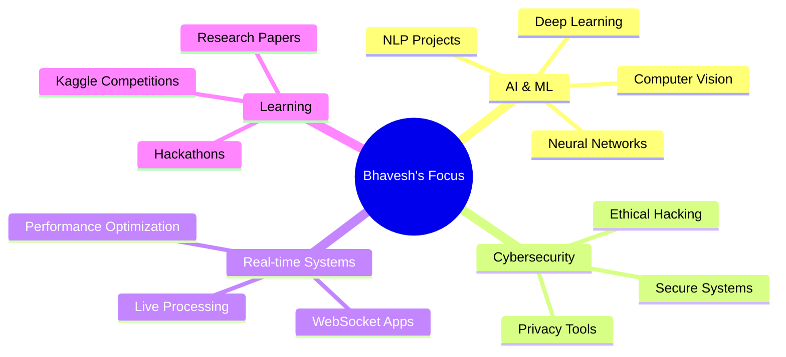
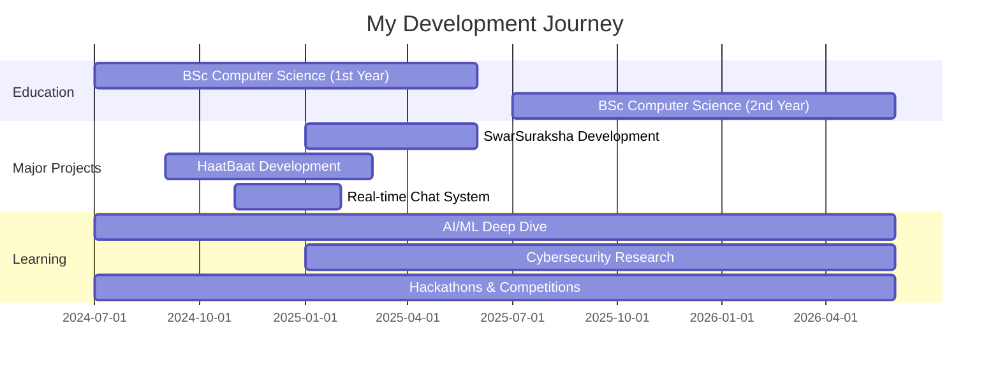

<div align="center">
  
</div>

<div align="center">
  
  [](https://git.io/typing-svg)
  
  
  
</div>

---

## 🚀 About Me

```python
class Bhavesh:
    def __init__(self):
        self.name = "Bhavesh Mali"
        self.role = "BSc Computer Science Student (2nd Year)"
        self.location = "India 🇮🇳"
        self.interests = [
            "Artificial Intelligence 🤖",
            "Machine Learning & Deep Learning 🧠",
            "Cybersecurity & Ethical Hacking 🔐",
            "Natural Language Processing 💬",
            "Computer Vision 👁️",
            "Real-time Systems ⚡"
        ]
        self.current_focus = "Building privacy-aware, security-focused solutions"
        
    def say_hi(self):
        print("Thanks for dropping by! Let's build something amazing together 🚀")

me = Bhavesh()
me.say_hi()
```

> 💡 I believe in building **practical, problem-solving tech** that's **useful, secure, and understandable**. My projects focus on **CLI-based tools**, **backend systems**, and **AI-powered applications** rather than just UI-heavy demos.

---

## 🏆 Featured Projects

<table>
<tr>
<td width="50%">

### 🎙️ SwarSuraksha
**Multilingual Voice-Based Driver Emotion Detection**

- Real-time emotion analysis for driver safety
- Multilingual support for Indian languages
- Voice processing with ML models
- Accident prevention through emotion monitoring

`Python` `TensorFlow` `Speech Recognition` `NLP`

</td>
<td width="50%">

### ✋ HaatBaat
**Indian Sign Language Recognition System**

- Gesture to text & voice conversion
- Neural network-based recognition
- Real-time hand tracking
- Accessibility-focused solution

`Python` `OpenCV` `Deep Learning` `MediaPipe`

</td>
</tr>

<tr>
<td width="50%">

### 💬 Real-Time Chat System
**Intelligent Chat Platform with AI Integration**

- WebSocket-based real-time messaging
- Integrated chatbot with NLP
- Secure authentication system
- Scalable backend architecture

`Node.js` `Socket.io` `MongoDB` `Python`

</td>
<td width="50%">

### 🎮 Educational Game Concepts
**Gamified Learning Experiences**

- Interactive learning modules
- Progress tracking & analytics
- Engaging UI/UX design
- Educational content delivery

`Python` `Game Development` `Data Analytics`

</td>
</tr>
</table>

---

## 💻 Tech Stack

<div align="center">

### Languages


### AI/ML & Data Science


### Backend & Databases


### Tools & Platforms


</div>

---

## 📊 GitHub Statistics

<div align="center">
  
  
</div>

<div align="center">
  
  
</div>

---

## 🎯 Current Focus

<div align="center">



</div>

---

## 🏅 Achievements & Highlights

<div align="center">

| 🎓 Education | 🏆 Competitions | 📚 Learning |
|:---:|:---:|:---:|
| BSc Computer Science | Hackathon Participant | Kaggle Datasets |
| 2nd Year Student | Project Showcases | Research-Oriented |
| AI/ML Specialization | Team Collaborations | Continuous Growth |

</div>

---

## 🎵 Spotify Playing

<div align="center">
  <a href="https://open.spotify.com/user/31frhsogdnfwyq3njzwsqqq4yxxa">
    
  </a>
</div>

---

## � Streak Stats

<div align="center">
  
</div>

---

## 📌 Pinned Repositories

<div align="center">
  <a href="https://github.com/Bhavesh1116/SwarSuraksha">
    
  </a>
  <a href="https://github.com/Bhavesh1116/HaatBaat">
    
  </a>
</div>

---

## 🎓 Skills & Expertise

<div align="center">

### 🤖 AI & Machine Learning
```
████████████████████░░  85%  Deep Learning & Neural Networks
███████████████████░░░  80%  Computer Vision (OpenCV, MediaPipe)
██████████████████░░░░  75%  Natural Language Processing
█████████████████░░░░░  70%  Speech Recognition & Audio Processing
```

### 🔐 Cybersecurity
```
████████████████░░░░░░  70%  Ethical Hacking & Penetration Testing
███████████████░░░░░░░  65%  Network Security
██████████████░░░░░░░░  60%  Cryptography & Privacy Tools
```

### 💻 Backend Development
```
█████████████████░░░░░  75%  Python (Flask, FastAPI)
████████████████░░░░░░  70%  Node.js & Express.js
███████████████░░░░░░░  65%  Database Management (MongoDB, SQL)
██████████████░░░░░░░░  60%  RESTful APIs & WebSockets
```

</div>

---

## 🌟 What I'm Up To

<table>
<tr>
<td width="50%">

#### 🔭 Currently Working On
- 🎙️ Enhancing SwarSuraksha with more languages
- 🤖 Building AI-powered security tools
- 📊 Kaggle competitions & datasets
- 🔐 Privacy-focused applications

</td>
<td width="50%">

#### 🌱 Currently Learning
- Advanced Deep Learning architectures
- Cloud computing (AWS, Azure)
- DevOps & CI/CD pipelines
- Blockchain & Web3 technologies

</td>
</tr>
<tr>
<td width="50%">

#### 👯 Looking to Collaborate On
- Open-source AI/ML projects
- Cybersecurity research
- Real-time systems
- Educational tech solutions

</td>
<td width="50%">

#### 💬 Ask Me About
- Python, Machine Learning, Deep Learning
- Computer Vision & NLP
- Backend development
- Cybersecurity best practices

</td>
</tr>
</table>

---

## 🎯 2026 Goals

<div align="center">

| Goal | Status | Progress |
|:-----|:------:|:--------:|
| 🏆 Win a major hackathon | 🔄 In Progress | ████████░░ 80% |
| 📚 Contribute to 10+ open source projects | 🔄 In Progress | ██████░░░░ 60% |
| 🎓 Complete advanced ML certifications | 🔄 In Progress | ███████░░░ 70% |
| 🚀 Launch 3 production-ready projects | 🔄 In Progress | █████░░░░░ 50% |
| 📝 Publish research paper | 📋 Planned | ███░░░░░░░ 30% |

</div>

---

## 💼 Experience & Projects Timeline



---

## 🛠️ Development Environment

<div align="center">

```yaml
OS: Windows 11 / Linux (Dual Boot)
Editor: VS Code with AI extensions
Terminal: Windows Terminal / Bash
Version Control: Git & GitHub
Package Manager: pip, npm, conda
Preferred Language: Python 🐍
Coding Style: Clean, documented, secure
Coffee Consumption: ☕☕☕☕☕ (High)
```

</div>

---

## 📊 Weekly Development Breakdown

<!--START_SECTION:waka-->
```text
Python       12 hrs 30 mins  ████████████░░░░░░░░  55.2%
JavaScript    4 hrs 15 mins  ████░░░░░░░░░░░░░░░░  18.8%
Research      3 hrs 20 mins  ███░░░░░░░░░░░░░░░░░  14.7%
Documentation 1 hr 30 mins   █░░░░░░░░░░░░░░░░░░░   6.6%
Other         1 hr 5 mins    █░░░░░░░░░░░░░░░░░░░   4.7%
```
<!--END_SECTION:waka-->

---

## 🎮 Hobbies & Interests

<div align="center">

| 💻 Tech | 🎵 Music | 📚 Learning | 🎯 Gaming |
|:-------:|:--------:|:-----------:|:---------:|
| Coding side projects | Spotify enthusiast | Reading research papers | Strategy games |
| Open source contributions | Multiple genres | Online courses | Problem-solving games |
| Tech blogs & articles | Coding playlists | Tech documentaries | Educational games |

</div>

---

## 📫 Connect With Me

<div align="center">
  
  [](https://www.linkedin.com/in/bhavesh-mali-459b20384)
  [](mailto:bhaveshmali1116@gmail.com)
  [](https://www.instagram.com/bhavesh_mali_1116?igsh=MnBqY2lnaXAxcGsx)
  [](https://github.com/Bhavesh1116)
  [](https://twitter.com/Bhavesh1116)
  [](https://discord.com)
  
  <br/>
  
  ### 📧 Email: bhaveshmali1116@gmail.com
  ### 💼 Open for collaborations and opportunities!
  
</div>

---

## 🎨 Fun Facts About Me

<div align="center">

```javascript
const bhavesh = {
    pronouns: "He/Him",
    code: ["Python", "JavaScript", "HTML/CSS", "SQL"],
    askMeAbout: ["AI/ML", "Cybersecurity", "Backend Dev", "Data Science"],
    technologies: {
        ai: ["TensorFlow", "PyTorch", "Keras", "scikit-learn"],
        backend: ["Node.js", "Express", "Flask", "FastAPI"],
        databases: ["MongoDB", "MySQL", "Firebase"],
        tools: ["Git", "Docker", "Jupyter", "VS Code"]
    },
    architecture: ["Microservices", "Event-Driven", "RESTful APIs"],
    currentChallenge: "Building AI that respects privacy and security",
    funFact: "I debug with console.log() and print() statements 😄"
};
```

</div>

---

## 🌐 Visitor Stats

<div align="center">
  
</div>

---

## 🎖️ GitHub Metrics

<div align="center">
  
</div>

---

## 🏅 Badges & Certifications

<div align="center">


</div>

---

## 💭 Random Dev Quote

<div align="center">
  
  
  
</div>

---

## 🐍 Contribution Snake

<picture>
  <source media="(prefers-color-scheme: dark)" srcset="https://raw.githubusercontent.com/Bhavesh1116/Bhavesh1116/output/github-contribution-grid-snake-dark.svg">
  <source media="(prefers-color-scheme: light)" srcset="https://raw.githubusercontent.com/Bhavesh1116/Bhavesh1116/output/github-contribution-grid-snake.svg">
  
</picture>

---

## 📈 Contribution Graph

<picture>
  <source media="(prefers-color-scheme: dark)" srcset="https://raw.githubusercontent.com/Bhavesh1116/Bhavesh1116/output/github-contribution-graph-dark.svg">
  <source media="(prefers-color-scheme: light)" srcset="https://raw.githubusercontent.com/Bhavesh1116/Bhavesh1116/output/github-contribution-graph.svg">
  
</picture>

---

## 🎨 Profile Trophy

<div align="center">
  
  
  
</div>

---

<div align="center">
  
  ### 💡 "Code is like humor. When you have to explain it, it's bad." – Cory House
  
  
  
  ### ⭐ From [Bhavesh1116](https://github.com/Bhavesh1116) with 💙
  
  
  
</div>
